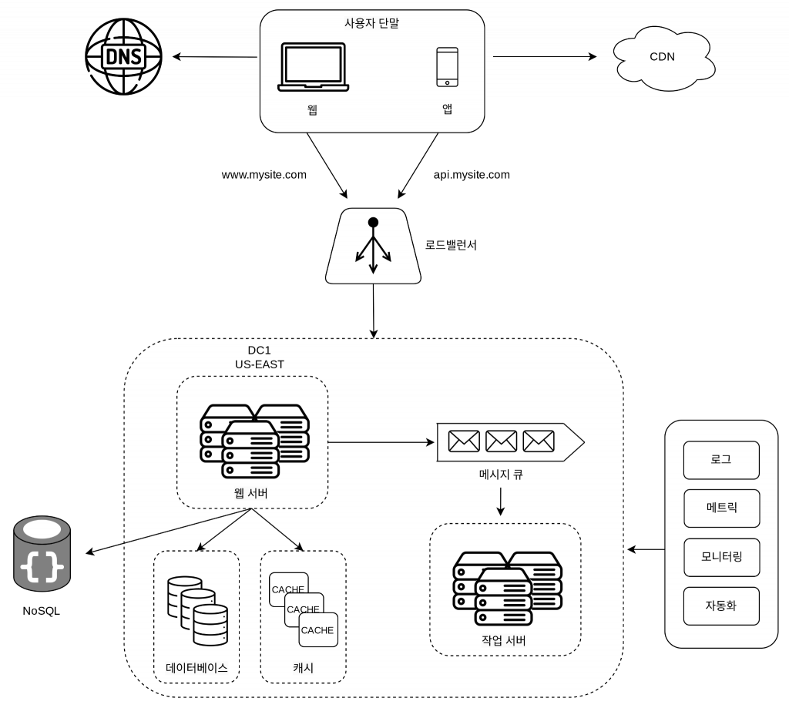

## 사용자 수에 따른 규모 확장성

### 단일 서버
### 데이터베이스
#### 1. 관계형 데이터 베이스: 

1) 자료를 테이블과 열, 칼럼으로 표현 
2) 조인으로 합치는 것 가능

#### 2. 비 관계형 데이터 베이스: 

1) 아주 낮은 응답 지연시간이 요구 
2) 다루는 데이터가 비정형일때 
3) 데이터를 직렬화하거나 역직렬화 할 수 있기만 하면 될 때 
2) 아주 많은 양의 데이터 

### 수직적 규모 확장 VS 수평적 규모 확장

#### 수직적 규모 확장
 서버에 고사양 자원(cpu,ram)을 추가하는 행위 

단점: 규모 확장의 한계,서버에 장애 발생시 웹사이트/앱 완전히 중단

-> 트래픽 양이 적을때 적합

#### 수평적 규모 확장
 더 많은 서버를 추가하여 성능 개선하는 행위 

#### 로드밸런서 
부하 분산 집합에 속한 웹서버들에게 트래픽을 "고르게" 분산하는 역할

#### ->로드밸런서는  어떻게 동작 하는가?

1. 사용자는 로드밸런서의 공개 ip주소로 접속 
2. 보안을 위해 서버사이의 통신에만 사용되는 사설ip주소 사용
3. 로드밸런서가 유입되는 트래픽을 여러 서버에 분산하여 처리

서버1이 다운되었을때 모든 트래픽을 서버2로 전송하여 전체가 다운되는 일 방지

#### 데이터베이스다중화
서버사이에 주-부 관계를 설정해 데이터 원본은 주서버에, 사본은 부 서버에 저장하는 방식

쓰기 연산은 마스터에서만 지원해 부 데이터베이스는 사본을 전달받아 읽기 연산만 지원

보통 읽기 연산 비중이 높기 때문에 부데이터 베이스가 많다.

#### 장점:
1. 더 나은 성능(병렬로 처리 될 수 있는 질의가 늘어남)
2. 안전성
3. 가용성

### 캐시
값비싼 연산 결과 또는 자주 참조되는 데이트를 메모리 안에 두고, 빨리 처리 될 수 있도록 하는 저장소

#### 동작방식
1. 요청받은 웹서버는 캐시에 응답이 있는지 확인

2. 있다면 해당 데이터를 클라이언트에 반환
3. 없다면 데이터 베이스 질의를 통해 데이터를 찾고 캐시에 저장한 뒤 반환

#### 캐시한 데이터 종류, 크기, 액세스 패턴에 맞는 캐시전략선택
#### 유의할 점
1. 어떠한 상황에 바람직한가? -> 데이터 갱신은 자주 일어나지 않지만 참조는 빈번할 때

2. 어떤 데이터를 넣을 것이가? -> 영속적으로 보관할 데이터는 바람직하지 않음 
3. 만료 정책을 설정해야한다.
4. 일관성 유지
5. 장애 대처-> 단일 장애지점을 피하기 위해서는 여러 지역에 걸쳐 캐시 서버 분산
6. 캐시 메모리 크기
7. 데이터방출 정책

### 콘텐츠 전송 네트워크(CDN)
정적 콘테츠를 전송하는데ㅔ 사용하는, 지리적으로 분산된 네트워크.
요청 경로, 질의 문자열,쿠키, 요청헤더 등의 정보에 기반하여 html페이지를 캐시하는것 

#### 동작 방법
사용자가 웹사이트를 방문하면 그 사용자에게 가장 가까운 CDN서버가 정적 콘텐츠를 전달

#### 고려해야할 점 
1. 비용
2. 적절한 만료 시한 설정
3. CDN장애에 대한 대처 방안
4. 콘텐츠 무효화

### 무상태 웹 계층
상태 정보(사용자 세션 데이터와 같은)를 관계형 데이터베이스나 NoSQL같은 지속성 저장소에 보관하고, 필요한 때 가져오도록 구성된 웹 계층을 무상태 웹계층이라고 부른다.

상태정보를 보관하는 서버는 클라이언트정보, 즉 상태를 유지하여 요청들 사이에 공유되도록한다. 무상태서버는 이런 장치가 없다. 

상태 의존적인 아키텍처

상태 의존적인 아키텍처에서는 클라이언트의 요청이 항상 같은 서버로 전송되어야 한다. 로드밸런서에서는 이를 지원하기 위해 고정 세션(sticky session)이라는 기능을 제공하는데 이는 로드밸런서에 부담을 준다. 게다가 서버를 추가하거나 제거하기도 까다로워지기 때문에 서버의 장애를 처리하기도 복잡해진다.

무상태 아키텍처

### 현재까지의 설계

### 데이터 센터
장애가 없는 상황에서 사용자는 가장 가까운 데이터 센터로 안내되는데, 통상 이 절차를 지리적 라우팅이라 한다.

지리적 라우팅에서 geoDNS는 사용자의 위치에 따라 도메인 이름을 어떤 IP 주소로 변환할지 결정할 수 있도록 해 주는 dns서비스 
트래픽 발생할 경우 나머지 데이터센터 사용 

#### 해결해야할 기술적 난제
1. 트래픽 우회(올바른 데이터센터로 보내는 효과적인 방법)
2. 데이터 동기화  (데이터 센터마다 다른 데이터베이스 사용하고 있을때)
3. 테스트와 배포

### 메세지 큐
메세지 무손실(보관된 메세지는 소비자가 꺼낼때까지 안전히 보관)을 보장하는 비동기 통신을 지원하는 컴포넌트 

장점:

서비스 또는 서버간 결합이 느슨해져 규모 확장성이 보장되어야하는 안정적 애플리케이션 구성에 용이

생산자는 소비자 프로세스가 다운되어있어도 메세지 발행 가능

### 로그, 메트릭 그리고 자동화
 규모가 커질때 주로 사용

 #### 로그: 
 에러 로그는 서버단위로 모니터링 가능하지만 단일서비스로 모아주는 도구를 활용가능
 #### 메트릭:
호스트 단위 메트릭:CPU, 메모리, 디스크 I/O 에 관한 메트릭

종합 메트릭: 데이터베이스 계층의 성능, 캐시 계층의 성능

핵심 비즈니스 메트릭: 일별 능동 사용자, 수익, 재방문

#### 자동화:
생상성을 높이기 위해 사용

### 데이터베이스의 규모확장
수직적 확장과 수평적 확장이 있다.
#### 수평적 확장
샤딩이라고도 불리며 대규모 데이터베이스를 샤드라고 부르는 작은 단위로 분할하는 기술 

같은 스키마를 쓰지만 보관되는 데이터 사이에 중복이 없음 

샤딩키는 파티션 키라고도 불림
어떻게 분산될지 정하는 하나 이상의 칼럼으로 구성
기준은 데이터를 고르게 분할하는것 

#### 해결해야 할 문제:
데이터의 재 샤딩 : 데이터가 많아져 하나의 샤드로 감당하기 어려울때, 샤드간 데이터 분포가 고르지 않을때 발생

유명인사 문제: 핫스팟키 문제라고도 불리며특정 샤드에 질의가 집중되어 서버에 과부하가 걸리는 문제

하나의 샤드에 유명인사들이 모두 들어있을때
해결을 위해서는 유명인사 각각에 샤드를 할당하거나 샤드를 더 잘게 쪼개야함.

조인과 비정규화: 여러개로 쪼갠 샤드는 조인이 힘들어진다. 해결을 위해 데이터베이스를 비정규화하여 하나의 테이블에서 질의 수행 

### 정리
#### 웹계층은 무상태 계층
#### 모든계층에 다중화활용  도입
#### 가능한 많은 데이터 캐시
#### 여러 데이터 센터 지원
#### 정적 콘텐츠는 CDN을 통해 서비스
#### 데이터 계층은 샤딩을 통해 그 규모를 확장
#### 각 계층은 독립적인 서비스로 분할
#### 지속적인 모니터링과 자동화 도구 