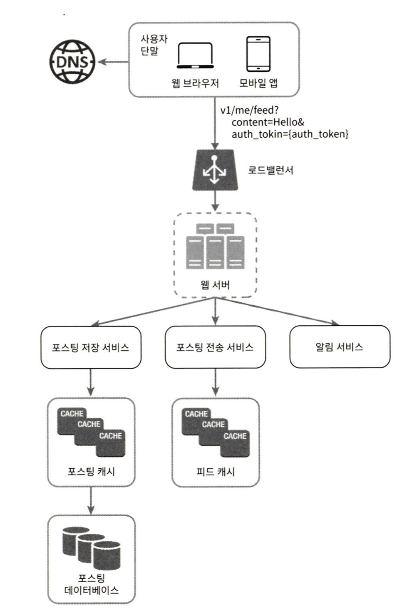
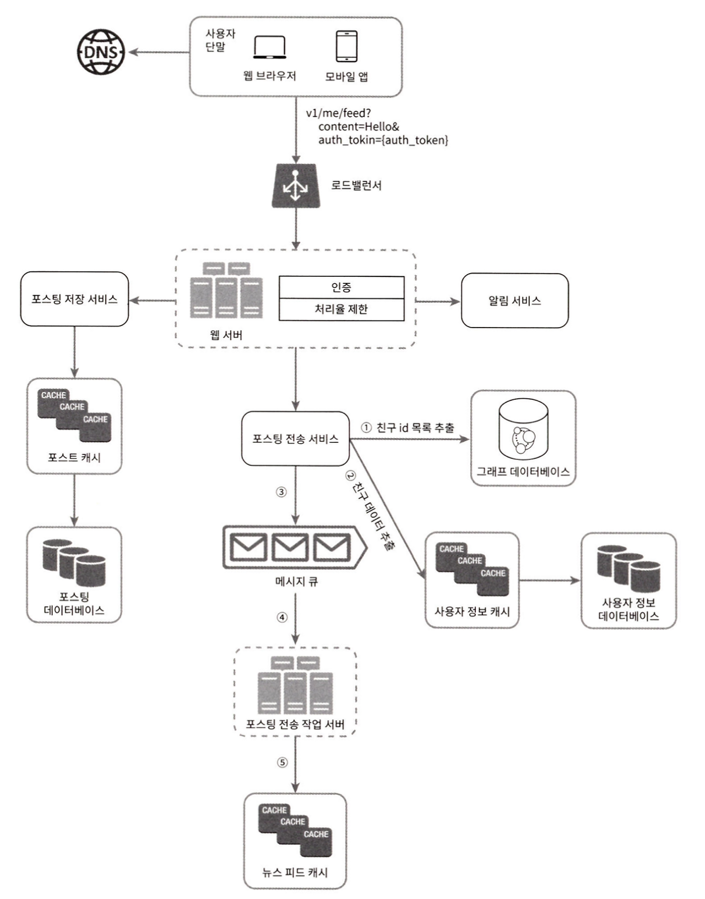
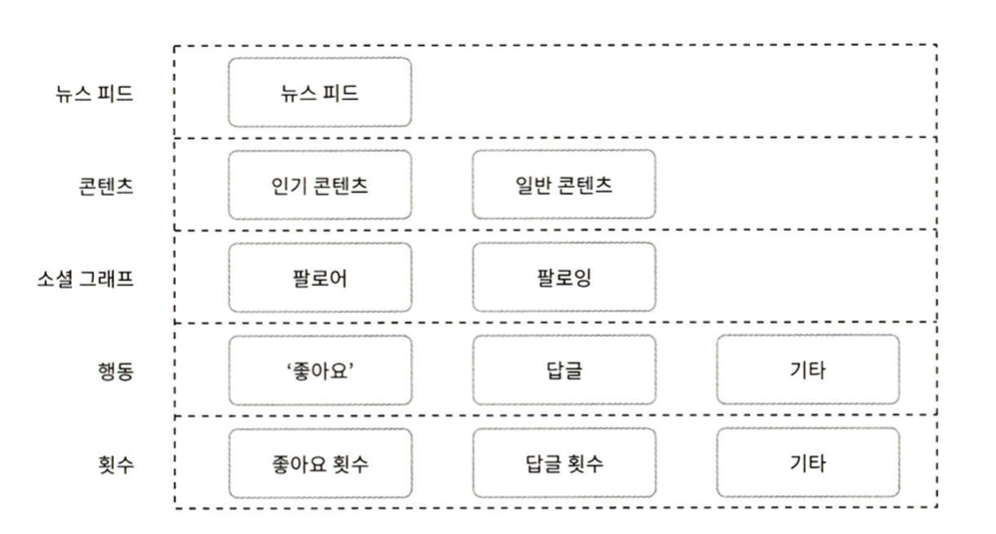

## 뉴스 피드 시스템 설계

### 1. 문제 이해 및 설계 범위 확정 
#

#### 상황 :  면접자가 나에게 뉴스 피드 시스템을 설계하라고 했을 때

#### 최소한 어떤 기능을 지원해야 하는지 파악해야한다.

ex) 

모바일앱, 웹 아니면 둘다? 

중요 기능은 어떤것이 있는지?

나열되는 피드의 순서

사용자는 최대 몇 명의 친구를 가질 수 있나?

트랙픽 규모

피드에 이미지나 비디오도 올릴 수 있는지?

### 2. 개략적 설계안 제시 및 동의 구하기
#

#### 뉴스 피드 api 설계

#### 피드 발행 api 
#### POST /v1/me/feed
{
바디: 포스팅 내용에 해당

authoriztion 헤더: 인증을 위해 사용}
#

#### 피드 읽기 api
#### GET /v1/me/feed
{authoriztion 헤더: 인증을 위해 사용}
#

로드밸러서: 트래픽을 웹서버로 분산

웹서버: http요청을 내부 서비스로 중계

포스팅 저장 서비스: 새 포스팅을 데이터베이스와 캐시에 저장

포스팅 전송 서비스: 새 포스팅을 친구의 뉴스 피드에 푸시, 뉴스 피드 데이터는 캐시에 보관

알람 서비스: 친구들에게 새 포스팅을 알리거나 푸쉬 알람

### 3.상세 설계
#

#### 피드 발행 흐름 상세 설계

웹서버: 인증이나 처리율 제한, 스팸 방지를 위해 한 사용자가 올릴 수 있는 포스팅 수 제한

포스팅 전송(팬아웃) 서비스

포스팅 전송, 즉 팬아웃은 어떤 사용자의 새 포스티을 그 사용자와 친구 관계에 있는 모든 사용자에게 전달하는 과정

#

#### 1. 쓰기 시점 팬 아웃(fanout-on-write,push모델)
새로운 포스팅을 기록할 때 뉴스피드 갱신

-> 포스팅이 완료되면 해당 사용자의 캐싱에 해당 포스팅 기록

장점 : 실시간으로 피드 갱신, 뉴스 피드를 읽는데 드는 시간이 짧아짐.

단점 : 친구가 많을 경우 갱신하는데 많은 시간 소요(핫키라고도 부름), 서비스 이용이 없는 사용자의 피드까지 갱신되 컴퓨팅 지원낭비(핫키라고도 부름)

#
#### 2. 읽기 시점에 팬아웃(fanout-on-read,pull모델)
피드를 읽어야 할 때 뉴스피드 갱신

요청 기반 모델로 사용자가 홈페이지나 타임라인을 로딩하는 시점에 새로운 포스트를 가져옴

장점 : 비활성화된 사용자, 서비스에 거의 로그인 하지 않는 경우 유리, 핫키 문제 생기지 않는다

단점 : 뉴스 피드를 읽는데 시간이 많이 소요

#### ==> 책에서 소개하는 설계안은 두 가지를 결합

#### 대부분의 사용자들은 푸쉬모델을 사용하고 친구나 팔로워가 만흔 사용자의 경우 풀모델 사용 하여 시스템 과부하 방지
또한 안정해시(안정 해시는 일반적으로 요청 또는 데이터를 서버에 균등하게 나누기 위해 일반적으로 사용되는 기술이다)를 통해 요청과 데이터를 고르게 분산해 핫키 문제를 줄인다. 

#### 캐시 구조

뉴스 피드:
뉴스피드의 ID를 보관한다.

콘텐츠:
포스팅 데이터를 보관하고 인기 콘텐츠는 따로 보관한다.

소셜 그래프:
사용자 간 관계 정보를 보관한다. (팔로워, 팔로잉)

행동:
‘좋아요’나 댓글 같은 사용자 행위에 관한 정보를 보관한다.

횟수:
‘좋아요’ 횟수, 응답 수, 팔로워 수, 팔로잉 수 등의 정보를 보관한다.

### 마무리
추가적으로 다음의 주제들로 규모 확장성이슈에 대해 고민해보는 것도 좋다

#### 데이터베이스 규모 확장

수직적 규모 확장 vs 수평적 규모 확장

SQL vs NoSQL

주-부 데이터베이스 다중화

복제본에 대한 읽기 연산

일관성 모델

데이터베이스 샤딩

#### 그 외 주제

웹 계층을 무상태로 운영하기

가능한 한 많은 데이터를 캐시할 방법

여러 데이터 센터를 지원할 방법

메시지 큐를 사용하여 컴포넌트 사이의 결합도 낮추기

핵심 메트릭에 대한 모니터링

트래픽이 몰리는 시간대의 QPS, 사용자 피드를 새로고침할 때의 지연시간